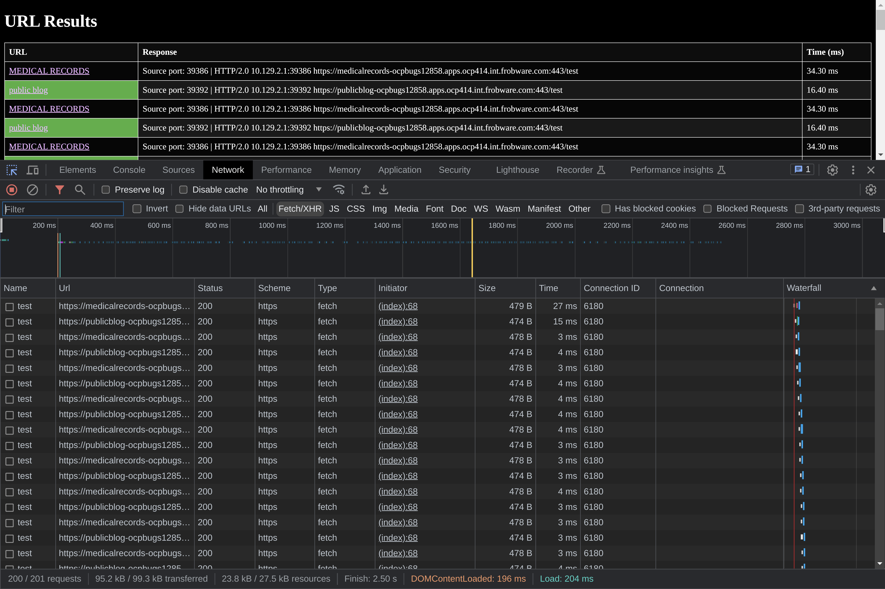
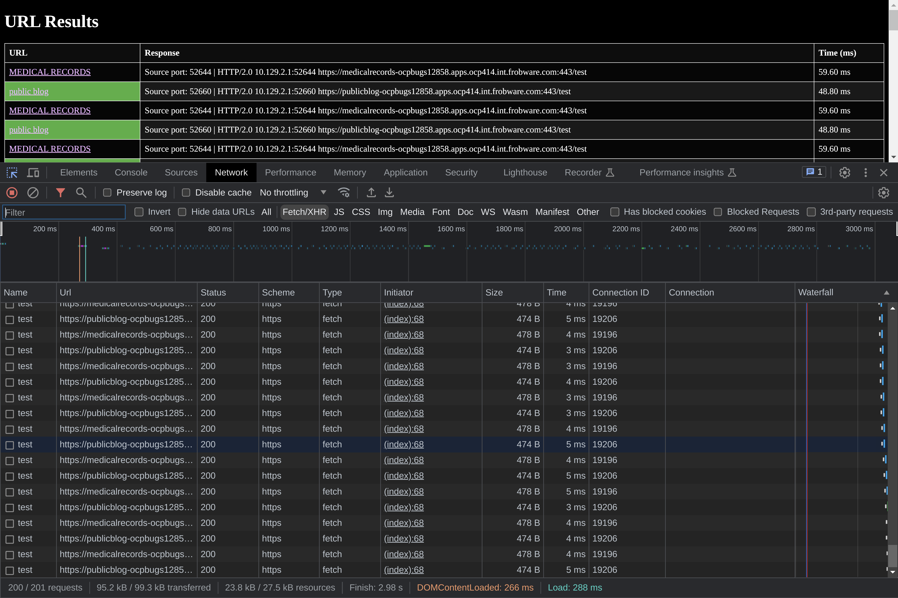

# https://issues.redhat.com/browse/OCPBUGS-12858

- https://daniel.haxx.se/blog/2016/08/18/http2-connection-coalescing/

I pushed scripts & setup to experiement and debug this issue to:
https://github.com/frobware/haproxy-hacks/tree/master/OCPBUGS-12858

To prove that connection coalescing takes place I have configured my
ingresscontroller to have HTTP/2 enabled. Assume HTTP/2 is enabled on
the ingresscontroller throughout from now on.

	% cat $(which router-enable-http2)
	#!/nix/store/8fv91097mbh5049i9rglc73dx6kjg3qk-bash-5.2-p15/bin/bash -e
	oc -n openshift-ingress-operator annotate --overwrite ingresscontrollers/${1:-default} ingress.operator.openshift.io/default-enable-http2=${2:-true}

	% router-enable-http2 default true
	ingresscontroller.operator.openshift.io/default annotated

I have configured three routes "medicalrecords", "publicblog", and
"browser-test", plus a backend server that is HTTP/2 and TLS capable:

	% ./hack/ocpbugs-12858-setup --use-ingress-wildcard-certificate-for-each-route
	make: Entering directory '/home/aim/src/github.com/frobware/haproxy-hacks/OCPBUGS-12858/server'
	make: Nothing to be done for 'all'.
	make: Leaving directory '/home/aim/src/github.com/frobware/haproxy-hacks/OCPBUGS-12858/server'
	~/src/github.com/frobware/haproxy-hacks/OCPBUGS-12858/browser-test ~/src/github.com/frobware/haproxy-hacks/OCPBUGS-12858
	deployment.apps/browser-test created
	service/browser-test created
	route.route.openshift.io/browser-test created
	~/src/github.com/frobware/haproxy-hacks/OCPBUGS-12858
	Extracting secrets from custom-certs
	# tls.crt
	# tls.key
	/tmp/tmp.ZsDBDlwEv7:
	total 12
	-rw-r--r-- 1 aim aim 5556 Aug 10 09:45 tls.crt
	-rw-r--r-- 1 aim aim 1675 Aug 10 09:45 tls.key
	~/src/github.com/frobware/haproxy-hacks/OCPBUGS-12858/ocpbugs12858-test ~/src/github.com/frobware/haproxy-hacks/OCPBUGS-12858
	service/ocpbugs12858-test created
	deployment.apps/ocpbugs12858-test created
	medicalrecords CN:  *.apps.ocp414.int.frobware.com
	publicblog_certdir CN:  *.apps.ocp414.int.frobware.com
	route.route.openshift.io/medicalrecords created
	route.route.openshift.io/publicblog created
	~/src/github.com/frobware/haproxy-hacks/OCPBUGS-12858
	Waiting for deployment "ocpbugs12858-test" rollout to finish: 0 of 1 updated replicas are available...
	deployment "ocpbugs12858-test" successfully rolled out
	Warning: apps.openshift.io/v1 DeploymentConfig is deprecated in v4.14+, unavailable in v4.10000+
	NAME                                     READY   STATUS    RESTARTS   AGE
	pod/browser-test-78b9945f6d-lmmfk        1/1     Running   0          6s
	pod/ocpbugs12858-test-5fdd88c9fd-7nplm   1/1     Running   0          3s

	NAME                        TYPE        CLUSTER-IP       EXTERNAL-IP   PORT(S)             AGE
	service/browser-test        ClusterIP   172.30.40.25     <none>        8443/TCP,8080/TCP   5s
	service/ocpbugs12858-test   ClusterIP   172.30.117.136   <none>        8443/TCP,8080/TCP   4s

	NAME                                READY   UP-TO-DATE   AVAILABLE   AGE
	deployment.apps/browser-test        1/1     1            1           6s
	deployment.apps/ocpbugs12858-test   1/1     1            1           3s

	NAME                                           DESIRED   CURRENT   READY   AGE
	replicaset.apps/browser-test-78b9945f6d        1         1         1       6s
	replicaset.apps/ocpbugs12858-test-5fdd88c9fd   1         1         1       3s

	NAME                                      HOST/PORT                                                  PATH   SERVICES            PORT   TERMINATION          WILDCARD
	route.route.openshift.io/browser-test     browser-test-ocpbugs12858.apps.ocp414.int.frobware.com            browser-test        8080                        None
	route.route.openshift.io/medicalrecords   medicalrecords-ocpbugs12858.apps.ocp414.int.frobware.com          ocpbugs12858-test   8443   reencrypt/Redirect   None
	route.route.openshift.io/publicblog       publicblog-ocpbugs12858.apps.ocp414.int.frobware.com              ocpbugs12858-test   8443   reencrypt/Redirect   None

The "medicalrecords" and "publicblog" routes, as just configured, both
specify a TLS certificate. As, per the openshift documentation, if a
route has its own certificate it will be configured in haproxy.config
to allow for end-to-end HTTP/2 (i.e., from client => haproxy =>
backend server). We can verify that our two routes have end-to-end
HTTP/2 enabled by looking for `alpn h2,http/1.1` in the haproxy
configuration, specifically the cert_config.map:

	% oc get pods -n openshift-ingress
	NAME                              READY   STATUS    RESTARTS   AGE
	router-default-7f55df7c8b-zqssw   2/2     Running   2          18h

	% oc rsh -n openshift-ingress router-default-7f55df7c8b-zqssw grep -r alpn . | grep cert_config.map
	Defaulted container "router" out of: router, logs
	./cert_config.map:/var/lib/haproxy/router/certs/ocpbugs12858:publicblog.pem [alpn h2,http/1.1] publicblog-ocpbugs12858.apps.ocp414.int.frobware.com
	./cert_config.map:/var/lib/haproxy/router/certs/ocpbugs12858:medicalrecords.pem [alpn h2,http/1.1] medicalrecords-ocpbugs12858.apps.ocp414.int.frobware.com

	% curl https://medicalrecords-ocpbugs12858.apps.ocp414.int.frobware.com/test
	Source port: 48308 | HTTP/2.0 10.129.2.1:48308 https://medicalrecords-ocpbugs12858.apps.ocp414.int.frobware.com:443/test

	% curl https://publicblog-ocpbugs12858.apps.ocp414.int.frobware.com/test
	Source port: 35534 | HTTP/2.0 10.129.2.1:35534 https://publicblog-ocpbugs12858.apps.ocp414.int.frobware.com:443/test

	% curl -vv https://publicblog-ocpbugs12858.apps.ocp414.int.frobware.com/test                       
	*   Trying 192.168.7.164:443...
	* Connected to publicblog-ocpbugs12858.apps.ocp414.int.frobware.com (192.168.7.164) port 443 (#0)
	* ALPN: offers h2,http/1.1
	* TLSv1.3 (OUT), TLS handshake, Client hello (1):
	* TLSv1.3 (IN), TLS handshake, Server hello (2):
	* TLSv1.3 (IN), TLS handshake, Encrypted Extensions (8):
	* TLSv1.3 (IN), TLS handshake, Certificate (11):
	* TLSv1.3 (IN), TLS handshake, CERT verify (15):
	* TLSv1.3 (IN), TLS handshake, Finished (20):
	* TLSv1.3 (OUT), TLS change cipher, Change cipher spec (1):
	* TLSv1.3 (OUT), TLS handshake, Finished (20):
	* SSL connection using TLSv1.3 / TLS_AES_128_GCM_SHA256
	* ALPN: server accepted h2
	* Server certificate:
	*  subject: CN=publicblog-ocpbugs12858.apps.ocp414.int.frobware.com
	*  start date: Aug  8 11:01:00 2023 GMT
	*  expire date: Nov  6 11:00:59 2023 GMT
	*  subjectAltName: host "publicblog-ocpbugs12858.apps.ocp414.int.frobware.com" matched cert's "publicblog-ocpbugs12858.apps.ocp414.int.frobware.com"
	*  issuer: C=US; O=Let's Encrypt; CN=R3
	*  SSL certificate verify ok.
	* using HTTP/2
	
	^^^^^^^^^^^^^^

	* h2 [:method: GET]
	* h2 [:scheme: https]
	* h2 [:authority: publicblog-ocpbugs12858.apps.ocp414.int.frobware.com]
	* h2 [:path: /test]
	* h2 [user-agent: curl/8.1.1]
	* h2 [accept: */*]
	* Using Stream ID: 1 (easy handle 0x644f80)
	> GET /test HTTP/2
	> Host: publicblog-ocpbugs12858.apps.ocp414.int.frobware.com
	> User-Agent: curl/8.1.1
	> Accept: */*
	> 
	* TLSv1.3 (IN), TLS handshake, Newsession Ticket (4):
	* TLSv1.3 (IN), TLS handshake, Newsession Ticket (4):
	* old SSL session ID is stale, removing
	< HTTP/2 200 
	< access-control-allow-headers: Content-Type, Access-Control-Allow-Headers, Authorization, X-Requested-With
	< access-control-allow-methods: GET,POST,OPTIONS,DELETE,PUT
	< access-control-allow-origin: *
	< content-type: text/plain; charset=utf-8
	< content-length: 117
	< date: Thu, 10 Aug 2023 10:58:32 GMT
	< set-cookie: 98c58f861899cef2d1f1693476547973=c592555d9f4bb00858081ea57509768f; path=/; HttpOnly; Secure; SameSite=None
	< 
	Source port: 47190 | HTTP/2.0 10.129.2.1:47190 https://publicblog-ocpbugs12858.apps.ocp414.int.frobware.com:443/test

The detailed curl request shows that HTTP/2.0 was negotiated.

But this doesn't tell us very much about connection coalescing.

To prove connection coealsing is taking place we can use the third
route "browser-test". If you open the "browser-test" URL that page
makes repeated and alternating calls to the "medicalrecords" and
"publicblog" endpoints. Using Chrome you can use the debug tools (hit
Ctrl-C when viewing the page) and, via the network tab, look at the
connection ID; I see the same connection ID used for every request
that is made by the browser-test page to either the "medicalrecords"
or "publicblog" URLs. This shows that the browser is reusing the
connection for both routes, although the routes are distict by name.

Why was the browser able to reuse the connection?

If the browser connects to the HTTP/2 URL "medicalrecords" which
resolves to IP address "192.168.7.164" and later connects to
"publicblog", it checks two things:

- Do the DNS entries match?
- Has "medicalrecords" provided a certificate that ALSO matches "publicblog"

In this case the answer to the DNS question is "yes". The IP address
is my load balancer:

	% dig publicblog-ocpbugs12858.apps.ocp414.int.frobware.com +short    
	192.168.7.164

	% dig medicalrecords-ocpbugs12858.apps.ocp414.int.frobware.com +short
	192.168.7.164

	% dig -x 192.168.7.164 +short
	api.ocp414.int.frobware.com.
	api-int.ocp414.int.frobware.com.
	lb-ocp414.int.frobware.com.

As for "do the certificates match?" the answer in this particular
setup is also "yes" becase I ran my setup scripts with
`--use-ingress-wildcard-certificate-for-each-route`. That option
extracts the TLS certificate from the ingress controller (my
`custom-certs`) which is a wildcard certificate. It then uses that
wildcard certificate in the tls.spec.{key,certificate} for both the
"medicalrecords" and "publicblog" routes.

If the browser's answer to both these questions is "yes" then the
browser will not initiate a second discrete connection but instead
reuse the existing connection and this is what we see in the
screenshot. The connection ID is always 6180 irrespective of whether
the request was to the "medicalrecords" URL or the "publicblog" URL.

If I re-run the setup without specifying
`--use-ingress-wildcard-certificate-for-each-route` then each of the
"medicalrecords" and "publicblog" routes will get their own discrete
certificate:

	% ./hack/ocpbugs-12858-setup                                                  
	route.route.openshift.io "browser-test" deleted
	route.route.openshift.io "medicalrecords" deleted
	route.route.openshift.io "publicblog" deleted
	service "browser-test" deleted
	service "ocpbugs12858-test" deleted
	deployment.apps "browser-test" deleted
	deployment.apps "ocpbugs12858-test" deleted
	make: Entering directory '/home/aim/src/github.com/frobware/haproxy-hacks/OCPBUGS-12858/server'
	make: Nothing to be done for 'all'.
	make: Leaving directory '/home/aim/src/github.com/frobware/haproxy-hacks/OCPBUGS-12858/server'
	~/src/github.com/frobware/haproxy-hacks/OCPBUGS-12858/browser-test ~/src/github.com/frobware/haproxy-hacks/OCPBUGS-12858
	deployment.apps/browser-test created
	service/browser-test created
	route.route.openshift.io/browser-test created
	~/src/github.com/frobware/haproxy-hacks/OCPBUGS-12858
	~/src/github.com/frobware/haproxy-hacks/OCPBUGS-12858/ocpbugs12858-test ~/src/github.com/frobware/haproxy-hacks/OCPBUGS-12858
	service/ocpbugs12858-test created
	deployment.apps/ocpbugs12858-test created
	medicalrecords CN:  medicalrecords-ocpbugs12858.apps.ocp414.int.frobware.com
	publicblog_certdir CN:  publicblog-ocpbugs12858.apps.ocp414.int.frobware.com
	route.route.openshift.io/medicalrecords created
	route.route.openshift.io/publicblog created
	~/src/github.com/frobware/haproxy-hacks/OCPBUGS-12858
	Waiting for deployment "ocpbugs12858-test" rollout to finish: 0 of 1 updated replicas are available...
	deployment "ocpbugs12858-test" successfully rolled out
	Warning: apps.openshift.io/v1 DeploymentConfig is deprecated in v4.14+, unavailable in v4.10000+
	NAME                                     READY   STATUS    RESTARTS   AGE
	pod/browser-test-78b9945f6d-bn2xb        1/1     Running   0          6s
	pod/ocpbugs12858-test-5fdd88c9fd-5clqz   1/1     Running   0          3s

	NAME                        TYPE        CLUSTER-IP       EXTERNAL-IP   PORT(S)             AGE
	service/browser-test        ClusterIP   172.30.221.118   <none>        8443/TCP,8080/TCP   5s
	service/ocpbugs12858-test   ClusterIP   172.30.85.185    <none>        8443/TCP,8080/TCP   4s

	NAME                                READY   UP-TO-DATE   AVAILABLE   AGE
	deployment.apps/browser-test        1/1     1            1           6s
	deployment.apps/ocpbugs12858-test   1/1     1            1           3s

	NAME                                           DESIRED   CURRENT   READY   AGE
	replicaset.apps/browser-test-78b9945f6d        1         1         1       6s
	replicaset.apps/ocpbugs12858-test-5fdd88c9fd   1         1         1       3s

	NAME                                      HOST/PORT                                                  PATH   SERVICES            PORT   TERMINATION          WILDCARD
	route.route.openshift.io/browser-test     browser-test-ocpbugs12858.apps.ocp414.int.frobware.com            browser-test        8080                        None
	route.route.openshift.io/medicalrecords   medicalrecords-ocpbugs12858.apps.ocp414.int.frobware.com          ocpbugs12858-test   8443   reencrypt/Redirect   None
	route.route.openshift.io/publicblog       publicblog-ocpbugs12858.apps.ocp414.int.frobware.com              ocpbugs12858-test   8443   reencrypt/Redirect   None

If we re-run the browser test we can see that the answer to the
questions about "same DNS" and "same certificate" no longer hold true;
the DNS is still the same but each route now has its own certificate.
As such connections to the "publicblog" use connection ID 19206 and
connections to "medicalrecords" use connection ID 19196; they are no
longer shared.

Note: with discrete certificates haproxy is able to do ALPN
negotiation for these two domains:

	% oc rsh -n openshift-ingress router-default-7f55df7c8b-zqssw grep -r alpn . | grep cert_config.map
	Defaulted container "router" out of: router, logs
	./cert_config.map:/var/lib/haproxy/router/certs/ocpbugs12858:publicblog.pem [alpn h2,http/1.1] publicblog-ocpbugs12858.apps.ocp414.int.frobware.com
	./cert_config.map:/var/lib/haproxy/router/certs/ocpbugs12858:medicalrecords.pem [alpn h2,http/1.1] medicalrecords-ocpbugs12858.apps.ocp414.int.frobware.com

With regard to the question in this bug: "what happens when you only
specify a destination CA certificate?"

We can re-run the setup to test this scenario:

	% ./hack/ocpbugs-12858-setup --set-destination-certificate-only 
	route.route.openshift.io "browser-test" deleted
	route.route.openshift.io "medicalrecords" deleted
	route.route.openshift.io "publicblog" deleted
	service "browser-test" deleted
	service "ocpbugs12858-test" deleted
	deployment.apps "browser-test" deleted
	deployment.apps "ocpbugs12858-test" deleted
	make: Entering directory '/home/aim/src/github.com/frobware/haproxy-hacks/OCPBUGS-12858/server'
	make: Nothing to be done for 'all'.
	make: Leaving directory '/home/aim/src/github.com/frobware/haproxy-hacks/OCPBUGS-12858/server'
	~/src/github.com/frobware/haproxy-hacks/OCPBUGS-12858/browser-test ~/src/github.com/frobware/haproxy-hacks/OCPBUGS-12858
	deployment.apps/browser-test created
	service/browser-test created
	route.route.openshift.io/browser-test created
	~/src/github.com/frobware/haproxy-hacks/OCPBUGS-12858
	~/src/github.com/frobware/haproxy-hacks/OCPBUGS-12858/ocpbugs12858-test ~/src/github.com/frobware/haproxy-hacks/OCPBUGS-12858
	service/ocpbugs12858-test created
	deployment.apps/ocpbugs12858-test created
	medicalrecords CN:  medicalrecords-ocpbugs12858.apps.ocp414.int.frobware.com
	publicblog_certdir CN:  publicblog-ocpbugs12858.apps.ocp414.int.frobware.com
	route.route.openshift.io/medicalrecords created
	route.route.openshift.io/publicblog created
	~/src/github.com/frobware/haproxy-hacks/OCPBUGS-12858
	Waiting for deployment "ocpbugs12858-test" rollout to finish: 0 of 1 updated replicas are available...
	deployment "ocpbugs12858-test" successfully rolled out
	Warning: apps.openshift.io/v1 DeploymentConfig is deprecated in v4.14+, unavailable in v4.10000+
	NAME                                     READY   STATUS    RESTARTS   AGE
	pod/browser-test-78b9945f6d-w2pxb        1/1     Running   0          7s
	pod/ocpbugs12858-test-5fdd88c9fd-hqj62   1/1     Running   0          4s

	NAME                        TYPE        CLUSTER-IP       EXTERNAL-IP   PORT(S)             AGE
	service/browser-test        ClusterIP   172.30.243.205   <none>        8443/TCP,8080/TCP   6s
	service/ocpbugs12858-test   ClusterIP   172.30.115.152   <none>        8443/TCP,8080/TCP   5s

	NAME                                READY   UP-TO-DATE   AVAILABLE   AGE
	deployment.apps/browser-test        1/1     1            1           7s
	deployment.apps/ocpbugs12858-test   1/1     1            1           4s

	NAME                                           DESIRED   CURRENT   READY   AGE
	replicaset.apps/browser-test-78b9945f6d        1         1         1       7s
	replicaset.apps/ocpbugs12858-test-5fdd88c9fd   1         1         1       4s

	NAME                                      HOST/PORT                                                  PATH   SERVICES            PORT   TERMINATION          WILDCARD
	route.route.openshift.io/browser-test     browser-test-ocpbugs12858.apps.ocp414.int.frobware.com            browser-test        8080                        None
	route.route.openshift.io/medicalrecords   medicalrecords-ocpbugs12858.apps.ocp414.int.frobware.com          ocpbugs12858-test   8443   reencrypt/Redirect   None
	route.route.openshift.io/publicblog       publicblog-ocpbugs12858.apps.ocp414.int.frobware.com              ocpbugs12858-test   8443   reencrypt/Redirect   None

Looking at the route spec for "medicalrecords" in this scenario we
see:

	- apiVersion: route.openshift.io/v1
	  kind: Route
	  spec:
		host: medicalrecords-ocpbugs12858.apps.ocp414.int.frobware.com
		port:
		  targetPort: 8443
		tls:
		  destinationCACertificate: |-
			-----BEGIN CERTIFICATE-----
			MIIDUTCCAjmgAwIBAgIIPmaeY/4Ow1cwDQYJKoZIhvcNAQELBQAwNjE0MDIGA1UE
			wW0LpKFxHF4PI/CNjFgrOZ555IVqpsf7tb612gl5P+lMPYvE2w==
			-----END CERTIFICATE-----
		  insecureEdgeTerminationPolicy: Redirect
		  termination: reencrypt
		to:
		  kind: Service
		  name: ocpbugs12858-test
		  weight: 100
		wildcardPolicy: None

	- apiVersion: route.openshift.io/v1
	  kind: Route
	  spec:
		host: publicblog-ocpbugs12858.apps.ocp414.int.frobware.com
		port:
		  targetPort: 8443
		tls:
		  destinationCACertificate: |-
			-----BEGIN CERTIFICATE-----
			MIIDUTCCAjmgAwIBAgIIPmaeY/4Ow1cwDQYJKoZIhvcNAQELBQAwNjE0MDIGA1UE
			JxkvWz8NmPdRn/rVIN3fjDGFItY4a39NnzywgSrzwfDpOUA5ZBVMMoEIyPBcuO3S
			E8Eh00GiX4raCOuuLb6INrO/eN7TuoVVC/j1vEDG9yP+YZdd9VseNOX96FPVrQJ7
			-----END CERTIFICATE-----
		  insecureEdgeTerminationPolicy: Redirect
		  termination: reencrypt
		to:
		  kind: Service
		  name: ocpbugs12858-test
		  weight: 100
		wildcardPolicy: None

Note the absence of TLS key/certificate. Without specifying a
certificate for a route the haproxy configuration would not be
configured to allow ALPN negotiation; the generated haproxy
configuration confirms that the cert_config.map no longer has ALPN
entries for our two routes / domains:

	% oc rsh -n openshift-ingress router-default-7f55df7c8b-zqssw grep -r alpn . | grep cert_config.map
	Defaulted container "router" out of: router, logs

Having a destinationCACertificate for a re-encrypt route focuses on
establishing trust between haproxy and the backend server and doesn't
influence the ALPN negotiation process between the client and haproxy.

Looking at the output from curl we see that with just the destination
certificate we can only negotiate HTTP/1.1:

	% curl -vv https://publicblog-ocpbugs12858.apps.ocp414.int.frobware.com/test
	*   Trying 192.168.7.164:443...
	* Connected to publicblog-ocpbugs12858.apps.ocp414.int.frobware.com (192.168.7.164) port 443 (#0)
	* ALPN: offers h2,http/1.1
	* TLSv1.3 (OUT), TLS handshake, Client hello (1):
	* TLSv1.3 (IN), TLS handshake, Server hello (2):
	* TLSv1.3 (IN), TLS handshake, Encrypted Extensions (8):
	* TLSv1.3 (IN), TLS handshake, Certificate (11):
	* TLSv1.3 (IN), TLS handshake, CERT verify (15):
	* TLSv1.3 (IN), TLS handshake, Finished (20):
	* TLSv1.3 (OUT), TLS change cipher, Change cipher spec (1):
	* TLSv1.3 (OUT), TLS handshake, Finished (20):
	* SSL connection using TLSv1.3 / TLS_AES_128_GCM_SHA256
	* ALPN: server did not agree on a protocol. Uses default.
	* Server certificate:
	*  subject: CN=*.apps.ocp414.int.frobware.com
	*  start date: Aug  2 12:12:04 2023 GMT
	*  expire date: Oct 31 12:12:03 2023 GMT
	*  subjectAltName: host "publicblog-ocpbugs12858.apps.ocp414.int.frobware.com" matched cert's "*.apps.ocp414.int.frobware.com"
	*  issuer: C=US; O=Let's Encrypt; CN=R3
	*  SSL certificate verify ok.
	* using HTTP/1.x

    ^^^^^^^^^^^^^^^^^^^^^

	> GET /test HTTP/1.1
	> Host: publicblog-ocpbugs12858.apps.ocp414.int.frobware.com
	> User-Agent: curl/8.1.1
	> Accept: */*
	> 
	* TLSv1.3 (IN), TLS handshake, Newsession Ticket (4):
	* TLSv1.3 (IN), TLS handshake, Newsession Ticket (4):
	* old SSL session ID is stale, removing
	< HTTP/1.1 200 
	< access-control-allow-headers: Content-Type, Access-Control-Allow-Headers, Authorization, X-Requested-With
	< access-control-allow-methods: GET,POST,OPTIONS,DELETE,PUT
	< access-control-allow-origin: *
	< content-type: text/plain; charset=utf-8
	< content-length: 117
	< date: Thu, 10 Aug 2023 10:41:41 GMT
	< set-cookie: 98c58f861899cef2d1f1693476547973=b03bc606e20953f8caf3ae31b963c454; path=/; HttpOnly; Secure; SameSite=None
	< 
	Source port: 47546 | HTTP/2.0 10.129.2.1:47546 https://publicblog-ocpbugs12858.apps.ocp414.int.frobware.com:443/test

As this is now HTTP/1.1 no connection coealsing can take place.

